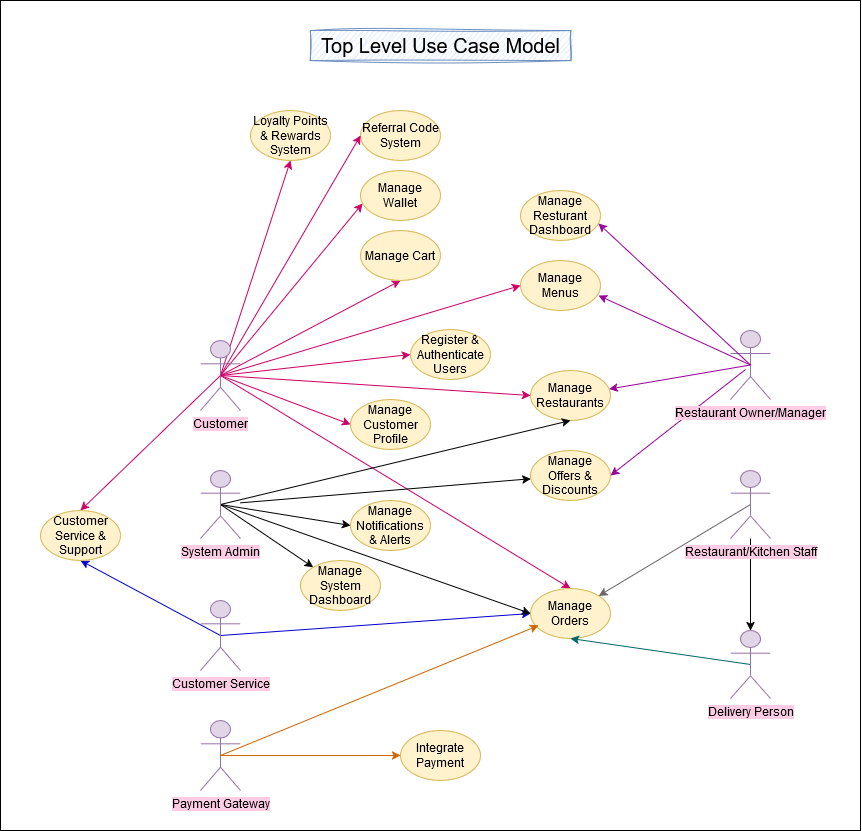
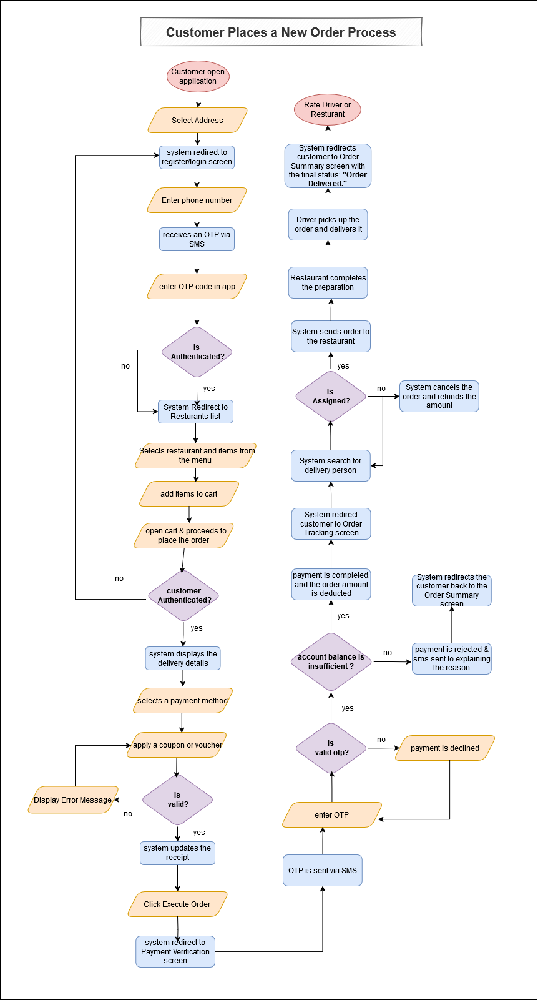
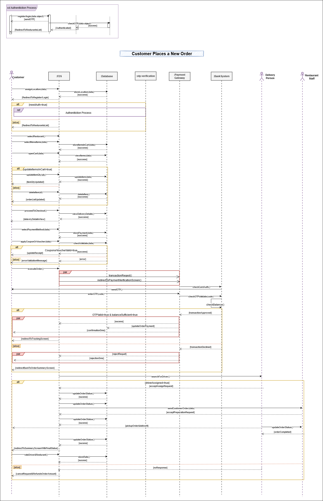

# Food Delivery Application

## Content List

1. [Vision](#vision)
2. [Features and Functionalities for the System](#features-and-functionalities)
3. [Use Case Model for the System](#use-case-model-for-the-system)  
   3.1. [Actors](#actors)  
   3.2. [Use Cases](#use-cases)  
   3.3. [Use Case Diagram](#use-case-diagram)  
4. [Manage Order Case](#manage-orders-use-case)  
   4.1. [Actors](#manage-order-use-case-actors)  
   4.2. [Manage order Use Case Flows](#manage-order-use-case-flows)  
   4.3. [Data Model](#data-model)  
   4.4. [Pseudocode](#pseudocode)  
   4.5. [UML Diagrams](#uml-diagrams)
---

## Vision  

The food delivery application is designed to offer customers a smooth and intuitive experience for discovering and ordering meals. Users can effortlessly search for nearby restaurants, explore menus with ease, and place orders quickly and without complications. The app also enables customers to track and manage their orders, take advantage of special discounts and promotions, and enjoy reliable, timely deliveries tailored to their schedules.

---
## Features and Functionalities for the System 

The detailed list of system features and functionalities is available in a separate document.  
Please refer to [Features and Functionalities Document](./features-documentation.md) for more details.

## Use Case Model for the System 

### `Actors of the System` 
- **Customer** : Searches for restaurants, browses menus, places orders, makes payments, and tracks deliveries.  
- **Restaurant Owner/Manager** : Manages restaurant listings, updates menus, processes orders, and handles order statuses.  
- **Restaurant/Kitchen Staff** : Prepares the food once an order is received.  
- **Delivery Person (Driver)** : Picks up orders from restaurants and delivers them to customers.  
- **System Administrator** : Oversees the entire system, manages users, resolves disputes, and ensures smooth operations.  
- **Customer Service** : Assists customers, delivery personnel, and restaurant owners in case of issues or inquiries.  
- **Payment Gateway Provider** : Handles secure online transactions for food orders.  

### `Main use cases` 
- **Register & Authenticate Users**: 
	- Users can sign up, log in, and manage their authentication securely. 
 - **Manage Customer Profile**: 
	- Customers can update their profile, manage addresses, payment methods, and preferences. 
 - **Manage Restaurants**: 
    - Admins and restaurant owners can add new restaurants , update Restaurant, Enable/Disable Restaurant to the platform
    - Customers can browse and view all available restaurants.
    - Customers can search for restaurants using filters like location, rating, type, etc
    - The system recommends restaurants to customers based on preferences and past activity.
 - **Manage Menus**: 
    - Restaurant owners can create, update, delete and manage menu items, including pricing and availability.
    - Restaurant owners can view the history of changes made to the restaurant’s menu.
    - Customers can search for specific menu items using filters like price, category, etc.
 - **Manage Cart**: 
    - Customers can add, remove, view & update quantity of items in their cart before placing an order. 
    - Customers proceed to checkout to enter shipping details, select payment methods, and confirm the order.
 - **Manage Orders**: 
    - Customers can place orders, while restaurants and delivery personnel handle order fulfillment.
    - Customers or restaurants can cancel an order before it's processed or delivered.
    - The system tracks and updates the order status ("Preparing," "On the way," "Delivered") in real-time & Notify the customer ) when there’s a change in their order status. 
    - Customers and restaurants can view their past orders, including details and statuses.
    - Customers and restaurants can view a summary of the order, including items, quantities, prices, and total amount.
    - Customers and restaurants can view detailed information for each order, such as delivery address, payment method, and special instructions.
 - **Integrate Payment**: 
    - Customers can securely make payments using different methods, and the system processes transactions. 
 - **Manage Offers & Discounts**: 
    - Admins and restaurant owners can create, apply, and update promotional offers and discounts.
 - **Manage Wallet**: 
    - Customers Add funds via credit card, refunds, or referral bonuses.
    - Customers can view detailed wallet transactions, including income and usage.
    - Customers can Track all wallet recharge transactions.
 - **Customer Service & Support**:  
    - Customers can raise issues, request refunds, or contact support for assistance. 
 - **Manage Notifications & Alerts**: 
    - The system sends real-time notifications about order status, promotions, and updates via email, SMS, or push notifications 
 - **Referral Code System**: 
    - Customers can share referral codes to invite new users and earn rewards. 
 - **Loyalty Points & Rewards System**: 
    - Customers earn points based on their purchases, which can be redeemed for discounts or free items. 
 - **Manage Dashboards**: 
    - Restaurant Dashboard – Restaurant owners can track orders, manage menus, and view performance analytics.
    - System Dashboard – Admins can monitor platform performance, user activities, and system analytics.


### `Use Case Diagram` 

A visual representation of use cases and actors

 

--- 

## Manage Order 

### `Actors`  
- Customer
- Restaurant/Kitchen Staff
- Delivery Person (Driver)
- Payment Gateway

### Manage Order Use Case Flows
  
### `Main Flow : Place New Order` 

#### Goal : 
The customer selects their preferred items and receives timely delivery at the specified location.

#### **Precondition** : 
- The customer is authenticated in the application using their phone number. 
- The restaurant is subscribed to the app, and its employees have the privilege to manage order requests. 

#### **Flow Steps** : 
1. The customer opens the application on their phone, and the system automatically assigns an address if location detection is enabled on the mobile device. Alternatively, the customer can manually assign an address using the map. 
2. When the location is successfully assigned, the system redirects the customer to the register/login screen. The customer then registers or logs in using their phone number and receives an OTP via SMS to complete the authentication process.  
3. When the customer is successfully authorized or remains unauthorized, the system directs them to a list of recommended restaurants based on the assigned location..  
4. To place a new order, the customer browses or searches for a restaurant and selects one to view its menu.  
5. The customer selects specific items from the menu and customizes them.  
6. The customer adds the selected items to the shopping cart.  
7. The customer opens the cart to review the items, update quantities, remove items or add a note for the restaurant.  
8. The system checks the customer's authorization. If authorized, they can proceed to checkout; otherwise, they are redirected to the register/login screen.
9. The system displays the delivery details, including the current delivery location. The customer can update the location or add a new one, and the system updates it accordingly.  
10. The customer selects a payment method. If they choose a credit card or Visa, they enter the necessary card details.  
11. If the customer does not select a payment method and wants to use the application’s wallet, the amount is deducted directly from the wallet. If the wallet balance is insufficient, the customer can recharge it or pay the remaining amount using a credit card or Visa.  
12. The customer can apply a coupon or voucher if available. The system validates it and updates the receipt accordingly.  
13. After selecting the delivery location, payment method, and reviewing the final order summary, the "Execute Order" button is enabled. The customer clicks on it to proceed to the **Payment Verification** screen for secure payment processing.  
14. On the **Payment Verification** screen:  
    - An OTP is sent via SMS to the phone number linked to the customer's credit card or Visa.  
    - The customer enters the OTP.  
    - If the entered OTP matches the sent code and the account has sufficient funds, the payment is completed, and the order amount is deducted. The customer is then redirected to the **Order Tracking** screen.  
    - If the OTP is incorrect, the payment is declined, and the customer can re-enter the correct code or request a new OTP.  
    - If the OTP is correct but the account balance is insufficient, the payment is rejected, and a message is sent to the customer explaining the reason. The customer is then redirected back to the **Order Summary** screen.  
15. After successful payment, the customer is redirected to the **Order Tracking** page.  
    - The system searches for a delivery person to accept the request.  
    - Once a delivery person is assigned, the order is sent to the restaurant for preparation.  
    - When the restaurant completes the preparation, the delivery person picks up the order and delivers it to the customer.  
    - The customer can track the order status at each stage:  
      **"Delivery person assigned," "Order is ready," "Delivery person is on the way,"** and **"Order delivered."**  
    - The customer can also track the delivery person's real-time location on the map.  
16. Upon receiving the order, the system saves the order details, allowing the customer to access them later for reordering or issue resolution. The customer is then redirected to the **Order Summary** screen, displaying the final status: **"Order Delivered."**  
17. After receiving the order, the customer can rate the delivery person and restaurant or submit a complaint if there is an issue with the order.

#### **Flowchart**: 
 

#### **Postcondition**: 
- **order Status Updated**: 
	- The restaurant order is either in a "Delivery person found,", "Order is ready"  , "Delivery person is on the way," or "Order delivered" state, depending on the actions taken by the restaurant and the delivery person.
. 
- **Notification Sent**: 
	- notification is sent to the customer each time the order status changes to keep them updated on its progress.
 - 
---
## Entities (Data Model)

--- **Will be added soon.**
---
## Pseudocode 

```plaintext 
--- **Will be added soon.**
``` 

## UML Diagrams 

### `Sequence Diagram `: 
 


 
