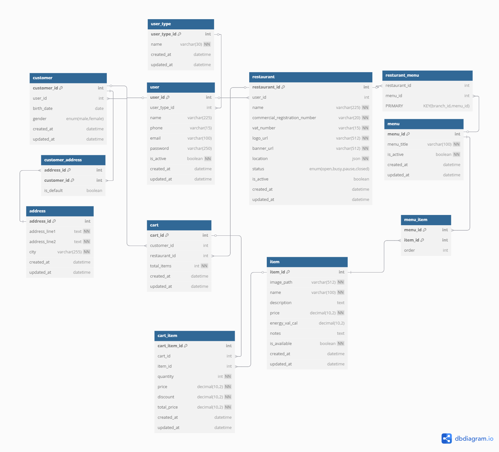

# Manage Cart – Use Case Documentation

This repository contains a comprehensive documentation for the Simple **Manage Cart** use case of a food delivery application. It includes the complete flow description, visual representations, data modeling, and supporting SQL scripts.

---

## Content List

1. [Overview](#overview)
2. [Manage Cart Use Case Flows](#manage-cart-use-case-flows)
3. [Flowchart Diagram](#flowchart-diagram)
4. [Sequence Diagram](#sequence-diagram)
5. [Entity Relationship Diagram (ERD)](#entity-relationship-diagram-erd)
6. [Data Model Description](#data-model-description)
7. [SQL Scripts](#sql-scripts)

---

## Overview

The **Manage Cart** use case enables customers of the food delivery application to manage the contents of their shopping cart. This functionality is crucial as it allows users to:

- Add menu items from a selected restaurant
- Customize and update their item selections
- Remove individual items or clear the entire cart
- Add special instructions for each item
- Review the total price dynamically
- Save the cart to proceed to checkout later

This documentation aims to present the full flow and underlying structure of the Manage Cart use case, including business logic, interaction diagrams, data storage schema, and implementation-ready SQL scripts.

---

## Manage Cart Use Case Flows

### **Main Flow**: Manage Cart  
**Goal**:  
The customer can add, update, and remove items in their shopping cart before placing an order.

**Precondition**:

- The customer is authenticated in the application using their phone number.  
- The restaurant is subscribed to the app, and its menu is available.

**Flow Steps**:

1. The customer opens the application, and the system assigns a delivery address either automatically (via location detection) or manually (via map).
2. If not authenticated, the customer is directed to register/login using their phone number and verifies it via OTP.
3. Once authenticated or browsing as a guest, the customer views a list of restaurants based on their selected location.
4. The customer selects a restaurant and browses its menu.
5. The customer selects items and customizes them (e.g., size, toppings, notes).
6. The customer adds the customized items to the cart.
7. The system confirms the item has been added and updates the cart icon/badge with the total number of items.
8. The customer can open the cart to review current selections.
9. Inside the cart:
   - The customer can update the quantity of each item.
   - The customer can remove items from the cart.
   - The customer can add special notes or instructions for the restaurant.
10. The system updates the cart total dynamically as changes are made.
11. The customer can clear the cart entirely if desired.
12. The customer can save the cart (if supported) to continue shopping later.
13. If the customer is ready, they can proceed to checkout (this leads into the “Place New Order” use case).

**Postcondition**:  
- The cart is saved in the system with all updated items and notes, ready for checkout or further modification.

---

## Flowchart Diagram

---

## Sequence Diagram

---

## Entity Relationship Diagram (ERD)

---

## Data Model Description

The data model for the **Manage Cart** use case includes core entities such as users, customers, restaurants, menus, items, and the cart itself. The following tables are used to support the cart operations:

### `user_type`
Defines the roles of users in the system, such as customers, drivers, partner employees, or internal employees.

- `user_type_id` (PK)
- `name` – Unique role name (e.g., "customer")
- `created_at`, `updated_at`

### `user`
Stores account details for users, including login credentials and contact information.

- `user_id` (PK)
- `user_type_id` – Foreign key to `user_type`
- `name`, `phone`, `email`, `password`
- `is_active`, `created_at`, `updated_at`

### `customer`
Links the user to a customer profile, including optional personal data.

- `customer_id` (PK)
- `user_id` – Foreign key to `user`
- `birth_date`, `gender`
- `created_at`, `updated_at`

### `address` and `customer_address`
Manages customer addresses. A customer may have multiple addresses with one marked as default.

- `address_id` (PK)
- `address_line1`, `address_line2`, `city`
- `created_at`, `updated_at`

- `customer_address` (composite PK of `customer_id` + `address_id`)
  - `is_default` – Indicates default delivery address
    

### `restaurant`
Stores restaurant registration and profile details.

- `restaurant_id` (PK)
- `user_id` – Foreign key to `user`
- `name`, `commercial_registration_number`, `vat_number`
- `logo_url`, `banner_url`, `location` (JSON)
- `status` (enum: open, busy, pause, closed)
- `is_active`, `created_at`, `updated_at`
  

### `menu` and `resturant_menu`
Defines menus for restaurants. Each restaurant can have multiple menus.

- `menu_id` (PK), `menu_title`, `is_active`
- `created_at`, `updated_at`

- `resturant_menu`: Composite table linking `restaurant_id` with `menu_id`

### `item` and `menu_item`
Represents individual menu items with pricing and availability.

- `item_id` (PK)
- `image_path`, `name`, `description`, `price`, `energy_val_cal`, `notes`
- `is_available`, `created_at`, `updated_at`

- `menu_item`: Composite table linking `menu_id` with `item_id`

### `cart`
Represents a customer’s cart, associated with one restaurant.

- `cart_id` (PK)
- `customer_id` – Foreign key to `customer`
- `restaurant_id` – Foreign key to `restaurant`
- `total_items`
- `created_at`, `updated_at`

### `cart_item`
Stores individual items within a cart along with pricing and quantity.

- `cart_item_id` (PK)
- `cart_id` – Foreign key to `cart`
- `item_id` – Foreign key to `item`
- `quantity`, `price`, `discount`, `total_price`
- `created_at`, `updated_at`

These entities together provide the full backend data structure for managing a customer's cart, supporting features such as adding/removing items, updating quantities, viewing total cost, and persisting cart state across sessions.

---

## SQL Scripts

[See: `sql_scripts.sql`](./sql_scripts.sql)

---
