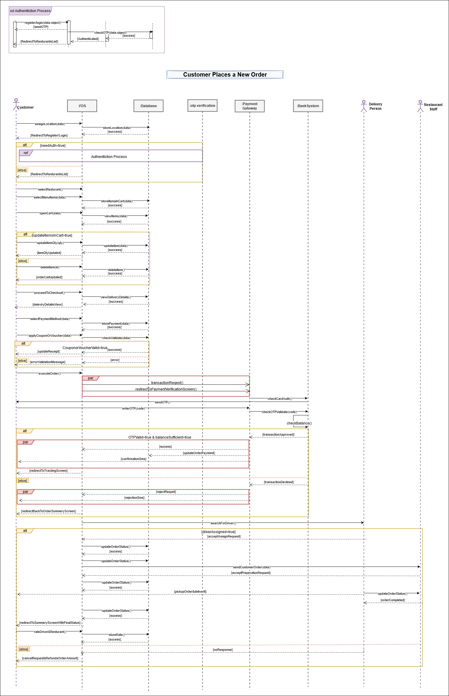

# Manage Cart – Use Case Documentation

This repository contains comprehensive documentation for the **Place Order** use case of a food delivery application. It includes the complete flow description, visual representations, data modeling, and supporting pseudocode and diagrams.
---

## Content List

1. [Overview](#overview)
2. [Manage order Use Case Flows](#manage-order-use-case-flows) 
3. [Flowchart Diagram](#flowchart-diagram)
4. [Sequence Diagram](#sequence-diagram)
5. [Pseudocode](#pseudocode)
6. [Entity Relationship Diagram (ERD)](#entity-relationship-diagram-erd)
7. [Data Model Description](#data-model-description)
8. [SQL Scripts](#sql-scripts)

---

## Overview

The **Place Order** use case enables customers of the food delivery application to seamlessly complete the ordering process—from selecting a delivery location and items to completing payment and receiving their order. This use case is essential for ensuring a smooth, secure, and user-friendly experience. It includes the ability to:

- Detect or manually assign a delivery location  
- Browse and select restaurants and menu items  
- Apply customizations and review cart contents  
- Choose a preferred payment method (wallet, credit card, etc.)  
- Apply discount coupons or vouchers  
- Complete secure payment with OTP verification  
- Track order status and delivery progress in real-time  
- Submit ratings or complaints after delivery  

This documentation presents the full flow and core logic of the Place Order use case, including business rules, interaction diagrams, data entities, and implementation-ready pseudocode.

---

## Manage Order Use Case Flows

### `Actors`  
- Customer
- Restaurant/Kitchen Staff
- Delivery Person (Driver)
- Payment Gateway

### `Main Flow : Place New Order` 
#### Goal : 
The customer selects their preferred items and receives timely delivery at the specified location.

#### **Precondition** : 
- The customer is authenticated in the application using their phone number. 
- The restaurant is subscribed to the app, and its employees have the privilege to manage order requests. 

#### **Flow Steps** : 
1. The customer opens the application on their phone, and the system automatically assigns an address if location detection is enabled on the mobile device. Alternatively, the customer can manually assign an address using the map. 
2. When the location is successfully assigned, the system redirects the customer to the register/login screen. The customer then registers or logs in using their phone number and receives an OTP via SMS to complete the authentication process.  
3. When the customer is successfully authorized or remains unauthorized, the system directs them to a list of recommended restaurants based on the assigned location..  
4. To place a new order, the customer browses or searches for a restaurant and selects one to view its menu.  
5. The customer selects specific items from the menu and customizes them.  
6. The customer adds the selected items to the shopping cart.  
7. The customer opens the cart to review the items, update quantities, remove items or add a note for the restaurant.  
8. The system checks the customer's authorization. If authorized, they can proceed to checkout; otherwise, they are redirected to the register/login screen.
9. The system displays the delivery details, including the current delivery location. The customer can update the location or add a new one, and the system updates it accordingly.  
10. The customer selects a payment method. If they choose a credit card or Visa, they enter the necessary card details.  
11. If the customer does not select a payment method and wants to use the application’s wallet, the amount is deducted directly from the wallet. If the wallet balance is insufficient, the customer can recharge it or pay the remaining amount using a credit card or Visa.  
12. The customer can apply a coupon or voucher if available. The system validates it and updates the receipt accordingly.  
13. After selecting the delivery location, payment method, and reviewing the final order summary, the "Execute Order" button is enabled. The customer clicks on it to proceed to the **Payment Verification** screen for secure payment processing.  
14. On the **Payment Verification** screen:  
    - An OTP is sent via SMS to the phone number linked to the customer's credit card or Visa.  
    - The customer enters the OTP.  
    - If the entered OTP matches the sent code and the account has sufficient funds, the payment is completed, and the order amount is deducted. The customer is then redirected to the **Order Tracking** screen.  
    - If the OTP is incorrect, the payment is declined, and the customer can re-enter the correct code or request a new OTP.  
    - If the OTP is correct but the account balance is insufficient, the payment is rejected, and a message is sent to the customer explaining the reason. The customer is then redirected back to the **Order Summary** screen.  
15. After successful payment, the customer is redirected to the **Order Tracking** page.  
    - The system searches for a delivery person to accept the request.  
    - Once a delivery person is assigned, the order is sent to the restaurant for preparation.  
    - When the restaurant completes the preparation, the delivery person picks up the order and delivers it to the customer.  
    - The customer can track the order status at each stage:  
      **"Delivery person assigned," "Order is ready," "Delivery person is on the way,"** and **"Order delivered."**  
    - The customer can also track the delivery person's real-time location on the map.  
16. Upon receiving the order, the system saves the order details, allowing the customer to access them later for reordering or issue resolution. The customer is then redirected to the **Order Summary** screen, displaying the final status: **"Order Delivered."**  
17. After receiving the order, the customer can rate the delivery person and restaurant or submit a complaint if there is an issue with the order.

**Postcondition**:  
- **order Status Updated**: 
	- The restaurant order is either in a "Delivery person found,", "Order is ready"  , "Delivery person is on the way," or "Order delivered" state, depending on the actions taken by the restaurant and the delivery person.
. 
- **Notification Sent**: 
	- notification is sent to the customer each time the order status changes to keep them updated on its progress.

---

## Flowchart Diagram

---

## Sequence Diagram

 

---

## Entity Relationship Diagram (ERD)

--- **Will be added soon.**

---

## Data Model Description

--- **Will be added soon.**
---

## Database Schema (PostgreSQL Compatible)

--- **Will be added soon.**
